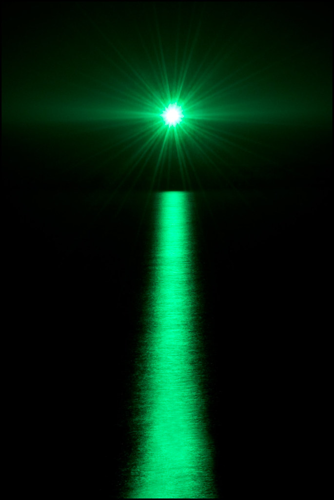

# Greenlight

### guerrilla data for analysts with deadlines.

 

>*"Gatsby believed in the green light, the orgiastic future that year by year recedes before us. It eluded us then, but that’s no matter—tomorrow we will run faster, stretch out our arms farther…. And one fine morning— So we beat on, boats against the current, borne back ceaselessly into the past."*

